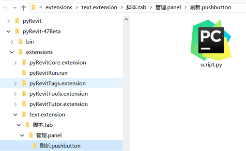
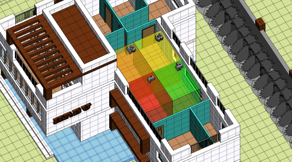

<h1>IndoorEnvironmentMonitoringSystem</h1>

<strong>IndoorEnvironmentMonitoringSystem是基于物联网、人工智能、BIM的背景下实现建筑室内环境质量无线监控系统。实现传感器实时无线采集建筑环境信息并上传到上位机，利用深度学习LSTM搭建模型评价环境质量等级，并实时显示到BIM模型中和网页上。本设计主要有嵌入式、上位机、室内环境质量等级评价模型、室内环境质量BIM模型和室内环境质量数据管理系统五大部分组成。</strong>

> 本项目源于19年全国建筑电气与智能化联合毕业设计。

## 功能
- 支持采集温度、湿度、烟雾、氨气、硫化物、苯系蒸汽 数据检测
- 拨码开关切换节点
- WIFI传输环境数据
- wxPython展示采集的环境数据
- MySQL存储环境数据
- AI智能评估环境质量等级
- Revit软件中渲染环境模型
- Web在线监测环境数据

## 注意事项
1. 涉及的嵌入式设备有Arduino Nano、DHT11、MQ-135、4位拨码开关、ESP8266、LCD1602、DC-DC电源转换

## 快速上手

### 嵌入式部分
嵌入式部分用Arduino Nano采集温湿度传感器DHT11环境质量MQ-135数据，实时显示在LCD1602显示屏上，且通过WiFi模块ESP8266发送到服务器端，通信协议使用的TCP协议；每个检测节点设有拨码开关调节，使用电池和电源转换模块单独供电。在制作过程中将元器件插在面包板上，再用热熔胶固定，电池盒与电源模块固定在PCB板上，最后用导线连接完成。(有条件可以自己制作PCD)
总线路图和硬件实物图如下

连接完成后将wifiuart/wifiuart.ino烧如Arduino

### 上位机部分
1. 环境安装
> 注意pytorch要单独先安装torch >= 1.7.0
> `pip install -r requirements.txt`

2. MySQL数据库初始化
节点采集数据表结构dip为节点号，类型为tinyint，长度是保存后自动配置的，temp为温度，humi为湿度，mq为环境质量，qual为环境质量等级，time为采集时间、ID为数据编号。

用户数据表结构。

3. 启动上位机
启动本地客户端ui，在server目录下
`python server.py`
4. 启动Django服务
BS目录下执行启动Django前后端服务
`python manage.py runserver`

### Revit部分
使用Revit打开/others/BIM/BIM.rvt
1. Autodesk revit 2016安装
Autodesk revit 2016，与普通的Autodesk软件安装类似，此处不再赘述；
2. Pyrevit安装
[Pyrevit官网](https://eirannejad.github.io/pyRevit/)： 下载并安装4.7.0版本

3. 检测安装是否成功
安装成功后，启动revit软件会弹出如下窗口

进入后，工具栏会多一个pyRevit模块，说明安装成功

`\others\BIM\text.extension`目录放在pyRevit目录下的如下位置
每个PyRevit小工具是一个固定格式的文件夹，PyRevit目录下打开‘extensions’文件夹，新建文件’text.extension’；打开后新建文件夹‘脚本.tab’；打开后新建文件夹‘管理.panel’；打开后新建文件夹‘刷新.pushbutton’；打开后添加脚本文件‘script.py’图标

## 技术架构与实现
整体架构图

技术架构图

### 嵌入式
嵌入式用Arduino nano采集温湿度传感器DHT11和污染气体传感器MQ-135数据，实时显示在LCD1602显示屏上，且通过WiFi模块ESP8266发送到上位机端，通信协议使用的TCP协议；每个检测节点设有拨码开关调节，使用电池和电源转换模块单独供电。

### 上位机
上位机使用Python调用Scoket搭建的TCP上位机解析WiFi模块传来的实时数据，并存入MySQL数据库中，使用WxPython实时显示在GUI图形化界面中。调取环境质量评价模型的模块获取环境质量等级，调取Revit的驱动模块，渲染到BIM模型中。

### 室内环境质量等级评价模型
室内环境质量评价模型使的深度学习的内容。使用LSTM模型搭建的，通过我们的训练能够较为准确的评价环境质量等级，将模型训练好后保存，封装完在上位机中调用。

### 室内环境质量BIM模型
室内环境质量BIM评价模型是使用的Revit建模软件搭建的建筑模型，通过Revit的API—PyRevit动态渲染到BIM模型对应节点中， Revit驱动封装好在上位机中调用。途中不同节点颜色表示对应节点的空气质量状态。

### 室内环境质量数据管理系统
室内环境质量数据管理系统是使用的Django开发，通过ORM技术实现Django操作数据库，利用ajax技术和基于Javascript的开源可视化库Echarts和基于jQuery技术将数据库里的数据发送到后台显示到前端。

## 效果展示
嵌入式部分制作了四个节点采集数据

Revit渲染情况展示，WXpython检测展示

前端数据实时检测

## 待办

- [x] 串口传参修改连接的上位机
- [x] WxPython GUI图形显示界面
- [x] MySQL数据库存储
- [ ] 绘制PCB代替面包板；
- [ ] 增加flash储存芯片，通过按键输入连接的WiFi和服务器；
- [ ] 在MCU上挂载更多的传感器，可以更准确的测量空气质量数据；
- [ ] 增加服务器返回控制功能，MCU接收到控制指令，做出反应，如启动风扇、应急照明灯；
- [ ] 上位机建数据库表，根据传感器型号和传感器的数据类型，自动建立合适的表；
- [ ] 在空气质量评价模型，增加训练数据集、优化模型结构进一步调高模型的准确度；
- [ ] 优化网页结构，增加数据查找功能。

## 贡献
欢迎PRs！如果你想为这个项目做贡献，你可以提交pr或issue，[待办](#待办)中有一些可以扩展的功能。我很高兴看到更多的人参与改进并优化它。
